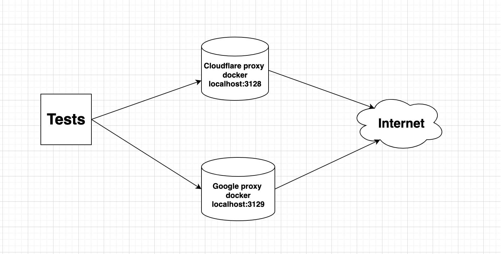

# DNS Test Platform (pytest-based)

### Overview 

This repository demonstrates a **lightweight, pytest-based test platform** designed to validate DNS performance and request handling in an **isolated, reproducible environment**.

The project focuses on:

- **configuration-driven test execution**

- **custom pytest fixtures and helpers**

- **dockerized test infrastructure**

- **clear separation between test logic and platform layer**

- **actionable reporting using Allure**

It is intentionally structured as a **mini test framework**, not a one-off test script.

## What this project demonstrates

- Building a **custom test platform on top of pytest engine**

- Managing **test configuration via YAML**

- Designing **reusable fixtures and test helpers**

- Running tests against **containerized DNS proxy infrastructure**

- Collecting **structured test results with Allure reporting**

- Reproducible local execution using Docker and virtual environments

## Project structure

```
DNS-Test/
├── configs/            # Global, environment-independent configuration (YAML)
├── docker/             # DNS proxy containers and configuration
├── resources/          # Test helpers and shared utilities
├── tests/              # Test cases
│   └── conftest.py     # Central pytest configuration and fixtures
├── pytest.ini          # Pytest configuration and reporting setup
├── requirements.txt
└── docker-compose.yml
```

This separation allows test logic to **stay clean and declarative**, while infrastructure and configuration remain reusable.

## Design decisions

### Why pytest as the test engine

Pytest was chosen for its:

- powerful fixture lifecycle

- plugin architecture

- simple extensibility

- suitability for building test platforms, not just test cases

## Configuration-driven execution

All global parameters are defined in configs/variables.yaml, allowing:

- environment changes without code modification

- easy scalability for additional DNS servers or scenarios

## Dockerized test environment

DNS proxies are created using lightweight Docker containers to ensure:

- isolation from host DNS configuration

- reproducible and comparable test results

- clear separation between test platform and system under test

## DNS performance tests
### DNS speed comparison

The platform currently compares DNS resolution performance for:

- **8.8.8.8 (Google DNS)**

- **1.1.1.1 (Cloudflare DNS)**

The ```dnsresolver``` package is used to send DNS queries and measure resolution time.
For this use case, **request speed and latency are treated as equivalent metrics**.

## Request count and page load time test

This scenario validates how DNS resolution impacts:

- number of outgoing requests

- overall page loading time

The test uses containerized DNS proxy services to simulate different DNS configurations.



This approach allows testing system behavior rather than isolated function calls.

## Running the test platform
### Prerequisites

- Python 3.x

- Docker + Docker Compose

### Setup and execution

Create virtual environment:
``` python3 -m venv .venv ```

Install dependencies:
``` pip3 install -r requirements.txt ```

Start DNS proxy containers:
```docker compose up -d --build ```

Run tests:
```pytest -c pytest.ini -s tests/```

## Reporting

Test results are collected using **Allure**.

Allure results directory is configured in pytest.ini:

``` --alluredir=reports/allure-results ```

Generate report:

```allure serve reports/allure-results```

This provides structured insights into test execution, duration, and failures.

## Possible extensions

This platform can be easily extended with:

- additional DNS providers

- flaky-test detection and retries

- CI/CD integration (Jenkins / GitHub Actions)

- custom pytest plugins and hooks

- performance trend analysis
